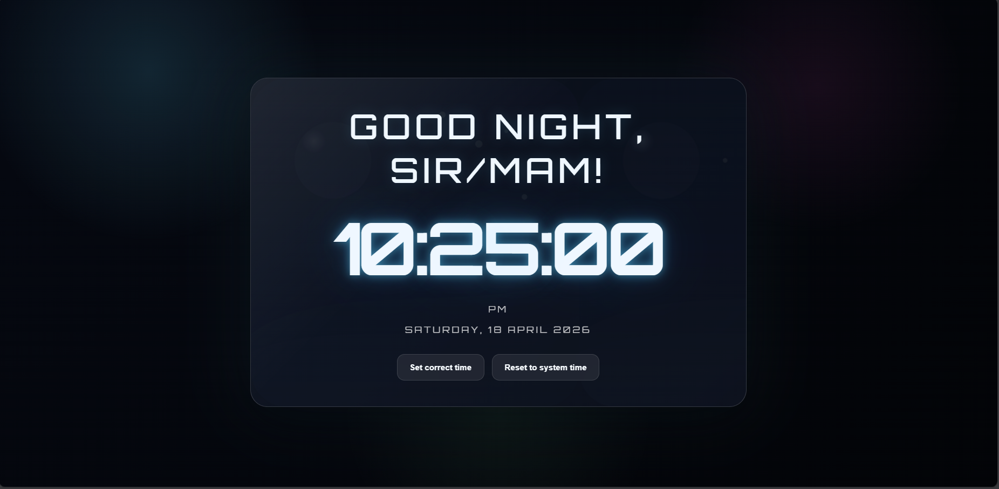
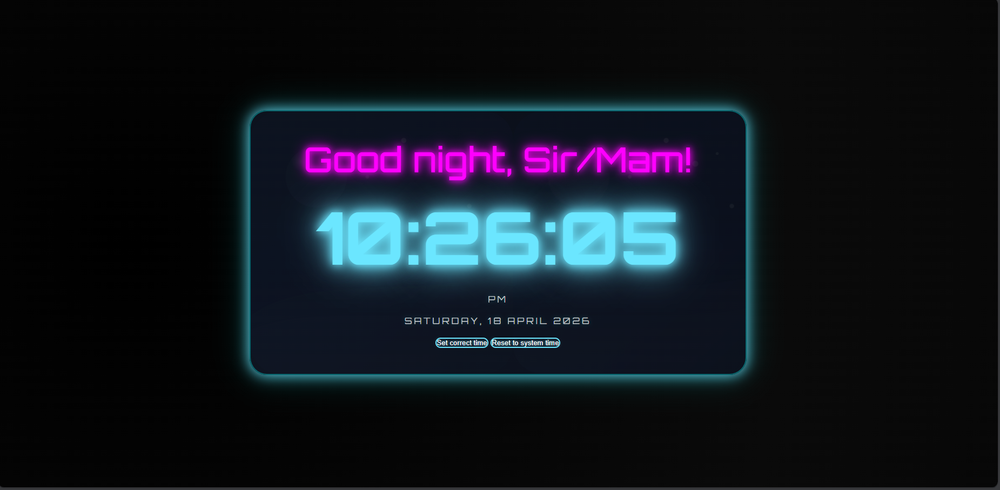
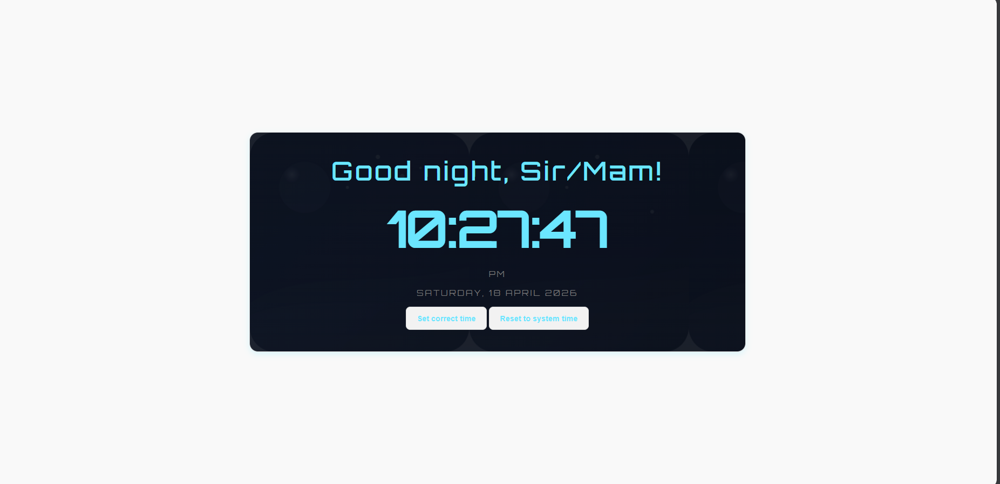
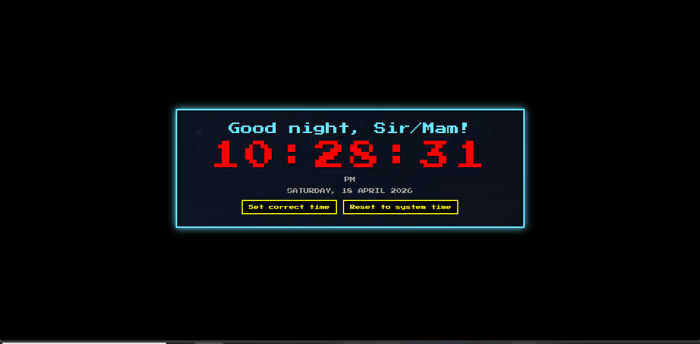
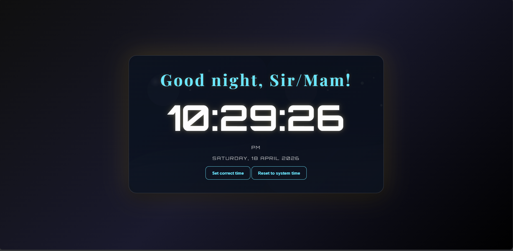
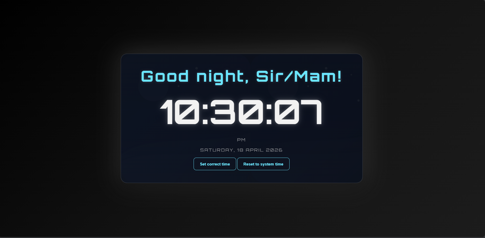

# ⏰ **Digital Clock**
A polished digital clock web project with **time-based greetings**, **changing backgrounds**, and a **neon glass UI**.

---

## 📂 Files
- **DC.html** → Main page for the clock  
- **flicker.css** → Styling and neon glass effects  
- **DC.js** → Clock logic, live time updates, theme switching, and greetings  
- **config.js** → Theme definitions, greetings, and background image references  
- **assets/** → Static image assets (SVGs + favicon)  

---

## 🚀 Usage
1. Open `digitalClock/DC.html` in a browser.  
2. The clock updates every second.  
3. Greeting changes based on the current time of day.  
4. Background uses themed SVG images stored in `assets/`.  

---

## 📝 Notes
- To change the **user name**, update `CLOCK_CONFIG.username` in `config.js`.  
- To change the **greetings**, edit the `greeting` values in `config.js`.  
- To change the **background images or theme styles**, edit the `bgImage` values in `config.js`.  
- `assets/` contains theme SVG images and the browser favicon.  

---

## 🎨 How to Customize
- **DC.html** → Page structure (open in browser)  
- **themes(contains css)* → Controls layout, glass effect, colors, and fonts  
- **DC.js** → Clock update logic, greeting application, theme switching  
- **config.js** → Defines theme entries and image sources used by DC.js  
- **assets/** → Stores image files referenced in config.js  

---

## 🔧 Recommended Edits
- Update `CLOCK_CONFIG.username` to change the displayed name  
- Replace `assets/*.svg` with your own images for custom backgrounds  
- Adjust `css code in Themes` for font size, card color, or button style  
- Use your browser inspector to quickly test CSS changes live  

---

## ✨ Features
- Live ticking digital clock  
- Manual time correction + reset button  
- AM/PM toggle  
- Dynamic backgrounds (morning, afternoon, evening, night)  
- Personalized greetings with your name  
- Responsive design with neon glass styling  

---

## 🖼 Theme Previews
Here are the included themes:
- Glassmorphism → Frosted glass look
- Neon Glow → Futuristic nightclub vibe
- Retro Pixel → Arcade style
- Minimalist → Clean flat design
- Modern Rich → Luxury gold aesthetic
- Dark Elegant → Sleek silver monochrome

## Screenshot of each Themes:
  

## 📜 License  
- **Personal Use** → For individual projects  
- **Commercial Use** → For client work or dashboards  
- **Extended License** → For resale or redistribution  

---

## 🌐 Demo
*(Optional: Add a GitHub Pages or Netlify link here so buyers can preview the clock live.)*
